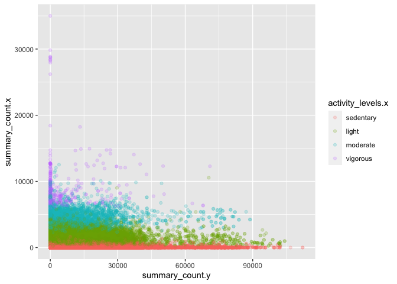

## Required packages

```r
library(tidyverse)
```

```
## ── Attaching packages ───────────────────────────────────────────────────────────────────────────────── tidyverse 1.3.0 ──
```

```
## ✓ ggplot2 3.3.2     ✓ purrr   0.3.4
## ✓ tibble  3.0.3     ✓ dplyr   1.0.2
## ✓ tidyr   1.1.2     ✓ stringr 1.4.0
## ✓ readr   1.3.1     ✓ forcats 0.5.0
```

```
## ── Conflicts ──────────────────────────────────────────────────────────────────────────────────── tidyverse_conflicts() ──
## x dplyr::filter() masks stats::filter()
## x dplyr::lag()    masks stats::lag()
```

```r
library(lubridate)
```

```
## 
## Attaching package: 'lubridate'
```

```
## The following objects are masked from 'package:base':
## 
##     date, intersect, setdiff, union
```

```r
library(ggplot2)
library(naniar)
library(ggmap)
```

```
## Google's Terms of Service: https://cloud.google.com/maps-platform/terms/.
```

```
## Please cite ggmap if you use it! See citation("ggmap") for details.
```

```r
library(ggthemes)
library(sf)
```

```
## Linking to GEOS 3.8.1, GDAL 3.1.1, PROJ 6.3.1
```

```r
library(rgeos)
```

```
## Loading required package: sp
```

```
## rgeos version: 0.5-5, (SVN revision 640)
##  GEOS runtime version: 3.8.1-CAPI-1.13.3 
##  Linking to sp version: 1.4-2 
##  Polygon checking: TRUE
```

```r
library(cancensus)
```

```
## Census data is currently stored temporarily.
## 
##  In order to speed up performance, reduce API quota usage, and reduce unnecessary network calls, please set up a persistent cache directory by setting options(cancensus.cache_path = '<path to cancensus cache directory>')
## 
##  You may add this option, together with your API key, to your .Rprofile.
```

```r
library(cowplot)
```

```
## 
## Attaching package: 'cowplot'
```

```
## The following object is masked from 'package:ggthemes':
## 
##     theme_map
```

```
## The following object is masked from 'package:ggmap':
## 
##     theme_nothing
```

```
## The following object is masked from 'package:lubridate':
## 
##     stamp
```

```r
library(ggspatial)
library(knitr)

setwd("/Users/dfuller/Dropbox/Projects/INTERACT_github/pa_phone_sensedoc/")
```

# Physical Activity

https://reader.elsevier.com/reader/sd/pii/S1440244011000788?token=EF8BC1F1D26E1549EB101EBB8B8F90E8A13690C5BBCE4B0E263DE65441B5D61D63D1E3CD243FE9138D314E9E6E13DB28

### Reading in the physical activity data from SenseDoc

```r
data_temp <- NULL

data_temp <- dir(path = "/Users/dfuller/Documents/INTERACT/data/sensors/", full.names = TRUE, pattern = "*_sd.csv", recursive = TRUE) %>%
   purrr::map(function(i){
     dfhx <- read.csv(i, header = TRUE)
     temp <- bind_rows(data_temp, dfhx)
   })

sd_data <- bind_rows(data_temp)
rm(data_temp)
table(sd_data$city)
```

```
## 
##  montreal saskatoon vancouver  victoria 
##   1196346    608068   1116693   1163567
```

### Reading in the physical activity data from Ethica

```r
data_temp <- NULL

data_temp <- dir(path = "/Users/dfuller/Documents/INTERACT/data/sensors/", full.names = TRUE, pattern = "*_ethica.csv", recursive = TRUE) %>%
   purrr::map(function(i){
     dfhx <- read.csv(i, header = TRUE)
     temp <- bind_rows(data_temp, dfhx)
   })

ethica_data <- bind_rows(data_temp)
rm(data_temp)
table(ethica_data$city)
```

```
## 
##  montreal saskatoon vancouver  victoria 
##    738181    428262    248729    275592
```

## Some basic cleaning


```r
sd_data <- sd_data %>% filter(wearing == 1)
ethica_data <- ethica_data %>% filter(wearing == 1)
```

## Applying Cut-points from this paper (using 3 axes VM)

https://www.sciencedirect.com/science/article/pii/S1440244011000788

    Light: 0 - 2690 CPM 
    Moderate: 2691 - 6166 CPM
    Vigorous: 6167 - 9642 CPM
    Very Vigorous: 9643 - ∞ CPM


```r
sd_data <- sd_data %>%
	mutate(activity_levels_vm3 = case_when(
		summary_count <= 2690 ~ "light",
		summary_count >= 2691 & summary_count <= 6166 ~ "moderate",
	  summary_count >= 6167 ~ "vigorous"
	))

ethica_data <- ethica_data %>%
	mutate(activity_levels_vm3 = case_when(
		summary_count <= 2690 ~ "light",
		summary_count >= 2691 & summary_count <= 6166 ~ "moderate",
	  summary_count >= 6167 ~ "vigorous"
	))
```

### Troiano cut-points on vertical axis counts


```r
sd_data <- sd_data %>%
	mutate(activity_levels = case_when(
		x_count < 100 ~ "sedentary",
		x_count >= 100 & x_count <= 1951 ~ "light",
		x_count >= 1951 & x_count <= 5724 ~ "moderate",
	  x_count >= 5725 ~ "vigorous"
	))

ethica_data <- ethica_data %>%
	mutate(activity_levels = case_when(
		x_count < 100 ~ "sedentary",
		x_count >= 100 & x_count <= 1951 ~ "light",
		x_count >= 1951 & x_count <= 5724 ~ "moderate",
	  x_count >= 5725 ~ "vigorous"
	))
```

## Create a date column and add a minutes in census tract by id, date, and census tract column 


```r
#### SenseDoc
sd_data$date <- sd_data$utcdate %>% as.Date()
sd_data$minutes <- 1

sd_data <- sd_data %>% 
  group_by(interact_id, date, city_id) %>% 
  mutate(
      minutes_id_date_city = sum(minutes)
  )

### Ethica
ethica_data$date <- ethica_data$utcdate %>% as.Date()
ethica_data$minutes <- 1

ethica_data <- ethica_data %>% 
  group_by(interact_id, date, city_id) %>% 
  mutate(
      minutes_id_date_city = sum(minutes)
  )
```

### MPVA Minutes SenseDoc


```r
table(sd_data$activity_levels)
```

```
## 
##     light  moderate sedentary  vigorous 
##   1210483    197700   2530586     16229
```

```r
table(sd_data$wearing)
```

```
## 
##       1 
## 3954998
```

```r
### MVPA Minutes
sd_data <- sd_data %>%
	mutate(mvpa_vm3 = case_when(
		activity_levels_vm3 == "light" ~ 0,
		activity_levels_vm3 == "moderate" ~ 1,
		activity_levels_vm3 == "vigorous" ~ 1
	))

table(sd_data$mvpa_vm3)
```

```
## 
##       0       1 
## 3632931  321833
```

```r
### Light Minutes
sd_data <- sd_data %>%
	mutate(light_vm3 = case_when(
		activity_levels_vm3 == "light" ~ 1,
		activity_levels_vm3 == "moderate" ~ 0,
		activity_levels_vm3 == "vigorous" ~ 0
	))

sd_data <- sd_data %>% 
    group_by(interact_id, date, city_id) %>% 
      mutate(
        total_mvpa_minutes = sum(mvpa_vm3),
        total_light_pa_minutes = sum(light_vm3)
        )

sd_pa_table <- sd_data %>%
                group_by(interact_id, date, city_id) %>%
                  summarize(
                    time = mean(minutes_id_date_city, na.rm = TRUE),
                    wearing = mean(wearing, na.rm = TRUE),
                    mean_mvpa_sd = mean(total_mvpa_minutes, na.rm = TRUE), 
                    mean_light_sd = mean(total_light_pa_minutes, na.rm = TRUE), 
                    na_count = sum(is.na(total_mvpa_minutes)), 
                    count = n()
                  )
```

```
## `summarise()` regrouping output by 'interact_id', 'date' (override with `.groups` argument)
```

```r
sd_pa_table
```

```
## # A tibble: 5,767 x 9
## # Groups:   interact_id, date [5,767]
##    interact_id date       city_id  time wearing mean_mvpa_sd mean_light_sd
##          <int> <date>     <chr>   <dbl>   <dbl>        <dbl>         <dbl>
##  1   101001706 2017-10-23 victor…    81       1            0            81
##  2   101001706 2017-10-24 victor…   755       1           26           729
##  3   101001706 2017-10-25 victor…   822       1           33           789
##  4   101001706 2017-10-26 victor…   652       1           23           629
##  5   101001706 2017-10-27 victor…   768       1           23           745
##  6   101001706 2017-10-28 victor…   679       1           30           649
##  7   101001706 2017-10-29 victor…   834       1           91           743
##  8   101001706 2017-10-30 victor…   785       1           87           698
##  9   101001706 2017-10-31 victor…   722       1           32           690
## 10   101001706 2017-11-01 victor…    48       1            7            41
## # … with 5,757 more rows, and 2 more variables: na_count <int>, count <int>
```

```r
sd_sum_table <- sd_pa_table %>%
                group_by(city_id) %>%
                  summarize(
                    time = mean(time, na.rm = TRUE), 
                    wearing = mean(wearing, na.rm = TRUE), 
                    mean_mvpa_sd = mean(mean_mvpa_sd, na.rm = TRUE), 
                    mean_light_sd = mean(mean_light_sd, na.rm = TRUE), 
                    na_count = sum(is.na(time)), 
                    count = n()
                  )
```

```
## `summarise()` ungrouping output (override with `.groups` argument)
```

```r
sd_sum_table
```

```
## # A tibble: 4 x 7
##   city_id    time wearing mean_mvpa_sd mean_light_sd na_count count
##   <chr>     <dbl>   <dbl>        <dbl>         <dbl>    <int> <int>
## 1 montreal   678.       1         53.8          621.        0  1744
## 2 saskatoon  666.       1         42.6          621.        0   787
## 3 vancouver  696.       1         58.1          633.        0  1588
## 4 victoria   694.       1         59.0          629.        0  1648
```

### MPVA Minutes Ethica


```r
table(ethica_data$activity_levels)
```

```
## 
##     light  moderate sedentary  vigorous 
##    259169    153299    971178    211647
```

```r
table(ethica_data$wearing)
```

```
## 
##       1 
## 1595293
```

```r
### MVPA Minutes
ethica_data <- ethica_data %>%
	mutate(mvpa_vm3 = case_when(
		activity_levels_vm3 == "light" ~ 0,
		activity_levels_vm3 == "moderate" ~ 1,
		activity_levels_vm3 == "vigorous" ~ 1
	))

table(ethica_data$mvpa_vm3)
```

```
## 
##       0       1 
## 1157249  437982
```

```r
### Light Minutes
ethica_data <- ethica_data %>%
	mutate(light_vm3 = case_when(
		activity_levels_vm3 == "light" ~ 1,
		activity_levels_vm3 == "moderate" ~ 0,
		activity_levels_vm3 == "vigorous" ~ 0
	))

ethica_data <- ethica_data %>% 
    group_by(interact_id, date, city_id) %>% 
      mutate(
        total_mvpa_minutes = sum(mvpa_vm3),
        total_light_pa_minutes = sum(light_vm3)
        )

eth_pa_table <- ethica_data %>%
                group_by(interact_id, date, city_id) %>%
                  summarize(
                    time = mean(minutes_id_date_city, na.rm = TRUE),
                    wearing = mean(wearing, na.rm = TRUE),
                    mean_mvpa_sd = mean(total_mvpa_minutes, na.rm = TRUE), 
                    mean_light_sd = mean(total_light_pa_minutes, na.rm = TRUE), 
                    na_count = sum(is.na(total_mvpa_minutes)), 
                    count = n()
                  )
```

```
## `summarise()` regrouping output by 'interact_id', 'date' (override with `.groups` argument)
```

```r
eth_pa_table
```

```
## # A tibble: 8,594 x 9
## # Groups:   interact_id, date [8,594]
##    interact_id date       city_id  time wearing mean_mvpa_sd mean_light_sd
##          <int> <date>     <chr>   <dbl>   <dbl>        <dbl>         <dbl>
##  1   101005415 2017-10-01 victor…   131       1           62            69
##  2   101005415 2017-10-02 victor…   134       1           77            57
##  3   101005415 2017-10-03 victor…   288       1          122           166
##  4   101005415 2017-10-04 victor…   277       1           84           193
##  5   101005415 2017-10-05 victor…   288       1          101           187
##  6   101005415 2017-10-06 victor…   288       1           97           191
##  7   101005415 2017-10-07 victor…   288       1          107           181
##  8   101005415 2017-10-08 victor…    58       1           47            11
##  9   101005415 2017-10-09 victor…   237       1          111           126
## 10   101005415 2017-10-10 victor…    10       1            0            10
## # … with 8,584 more rows, and 2 more variables: na_count <int>, count <int>
```

```r
eth_sum_table <- eth_pa_table %>%
                group_by(city_id) %>%
                  summarize(
                    time = mean(time, na.rm = TRUE), 
                    wearing = mean(wearing, na.rm = TRUE), 
                    mean_mvpa_sd = mean(mean_mvpa_sd, na.rm = TRUE), 
                    mean_light_sd = mean(mean_light_sd, na.rm = TRUE), 
                    na_count = sum(is.na(time)), 
                    count = n()
                  )
```

```
## `summarise()` ungrouping output (override with `.groups` argument)
```

```r
eth_sum_table
```

```
## # A tibble: 4 x 7
##   city_id    time wearing mean_mvpa_sd mean_light_sd na_count count
##   <chr>     <dbl>   <dbl>        <dbl>         <dbl>    <int> <int>
## 1 montreal   139.       1         7.69          131.        0  4877
## 2 saskatoon  381.       1       200.            181.        0  1105
## 3 vancouver  193.       1        84.4           108.        0  1256
## 4 victoria   189.       1        53.8           135.        0  1356
```

### Joining SenseDoc and Ethica


```r
sd_eth <- inner_join(sd_data, ethica_data, by = c("interact_id", "utcdate"))

summary(sd_eth$summary_count.x)
```

```
##    Min. 1st Qu.  Median    Mean 3rd Qu.    Max. 
##     0.0     0.0   113.3   773.5  1054.6 35005.8
```

```r
summary(sd_eth$summary_count.y)
```

```
##     Min.  1st Qu.   Median     Mean  3rd Qu.     Max. 
##      0.0      0.0    459.8   6722.7   9646.8 112187.9
```

```r
cor.test(sd_eth$summary_count.x, sd_eth$summary_count.y)
```

```
## 
## 	Pearson's product-moment correlation
## 
## data:  sd_eth$summary_count.x and sd_eth$summary_count.y
## t = -2.5603, df = 107217, p-value = 0.01046
## alternative hypothesis: true correlation is not equal to 0
## 95 percent confidence interval:
##  -0.013803948 -0.001833331
## sample estimates:
##         cor 
## -0.00781892
```

### Cross tab between VM3 cut points 


```r
table(sd_eth$activity_levels_vm3.x, sd_eth$activity_levels_vm3.y)
```

```
##           
##            light moderate vigorous
##   light    58934     8421    31005
##   moderate  5010      604     2402
##   vigorous   498       64      267
```

### Cross tab between vertial axis cut points 


```r
table(sd_eth$activity_levels.x, sd_eth$activity_levels.y)
```

```
##            
##             light moderate sedentary vigorous
##   light      4786     4114     16795     6238
##   moderate    853      675      2962     1223
##   sedentary 10525     9244     34905    14508
##   vigorous     53       50       213       75
```

### Regressing Sensedoc vertical axis count categories on Ethica data VM3 data


```r
glimpse(sd_eth$activity_levels.x)
```

```
##  chr [1:107219] "light" "light" "light" "light" "light" "sedentary" ...
```

```r
sd_eth$activity_levels.x <- as.factor(sd_eth$activity_levels.x)

sd_eth$activity_levels.x <- relevel(sd_eth$activity_levels.x, ref = 3)   

lm_eth_vm3 <- lm(summary_count.y ~ activity_levels.x, data = sd_eth)
summary(lm_eth_vm3)
```

```
## 
## Call:
## lm(formula = summary_count.y ~ activity_levels.x, data = sd_eth)
## 
## Residuals:
##    Min     1Q Median     3Q    Max 
##  -6988  -6837  -6243   2926 105351 
## 
## Coefficients:
##                           Estimate Std. Error t value Pr(>|t|)    
## (Intercept)                6836.85      44.68 153.016  < 2e-16 ***
## activity_levels.xlight     -403.24      79.51  -5.072 3.95e-07 ***
## activity_levels.xmoderate   151.33     161.78   0.935    0.350    
## activity_levels.xvigorous  -571.45     596.01  -0.959    0.338    
## ---
## Signif. codes:  0 '***' 0.001 '**' 0.01 '*' 0.05 '.' 0.1 ' ' 1
## 
## Residual standard error: 11750 on 107215 degrees of freedom
## Multiple R-squared:  0.0002737,	Adjusted R-squared:  0.0002458 
## F-statistic: 9.786 on 3 and 107215 DF,  p-value: 1.887e-06
```

```r
ggplot(sd_eth, aes(x = summary_count.y, y = summary_count.x, colour = activity_levels.x)) + 
        geom_point(alpha = 0.2)
```

<!-- -->


